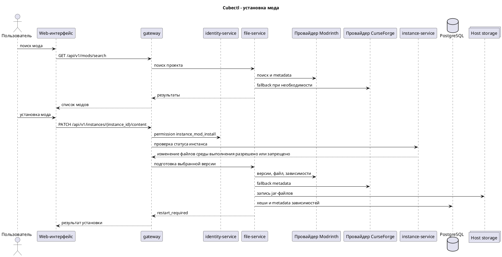

# Установка мода

```puml
@startuml
title Cubectl - установка мода

actor "Пользователь" as User
participant "Web-интерфейс" as UI
participant "gateway" as Gateway
participant "identity-service" as Identity
participant "file-service" as File
participant "Провайдер Modrinth" as Modrinth
participant "Провайдер CurseForge" as CurseForge
participant "instance-service" as Instance
database "PostgreSQL" as Postgres
collections "Host storage" as Storage

User -> UI: поиск мода
UI -> Gateway: GET /api/v1/mods/search
Gateway -> File: поиск проекта
File -> Modrinth: поиск и metadata
File -> CurseForge: fallback при необходимости
File --> Gateway: результаты
Gateway --> UI: список модов

User -> UI: установка мода
UI -> Gateway: PATCH /api/v1/instances/{instance_id}/content
Gateway -> Identity: permission instance_mod_install
Gateway -> Instance: проверка статуса инстанса
Instance --> Gateway: изменение файлов среды выполнения разрешено или запрещено
Gateway -> File: подготовка выбранной версии
File -> Modrinth: версии, файл, зависимости
File -> CurseForge: fallback metadata
File -> Storage: запись jar-файлов
File -> Postgres: хеши и metadata зависимостей
File --> Gateway: restart_required
Gateway --> UI: результат установки
@enduml
```
