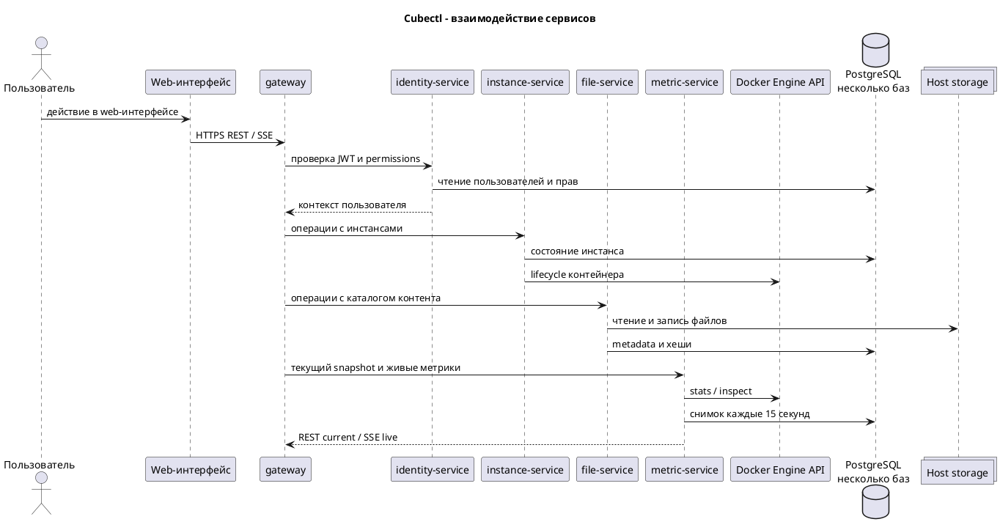

# Взаимодействие сервисов

```puml
@startuml
title Cubectl - взаимодействие сервисов

actor "Пользователь" as User
participant "Web-интерфейс" as UI
participant "gateway" as Gateway
participant "identity-service" as Identity
participant "instance-service" as Instance
participant "file-service" as File
participant "metric-service" as Metric
participant "Docker Engine API" as Docker
database "PostgreSQL\nнесколько баз" as Postgres
collections "Host storage" as Storage

User -> UI: действие в web-интерфейсе
UI -> Gateway: HTTPS REST / SSE
Gateway -> Identity: проверка JWT и permissions
Identity -> Postgres: чтение пользователей и прав
Identity --> Gateway: контекст пользователя

Gateway -> Instance: операции с инстансами
Instance -> Postgres: состояние инстанса
Instance -> Docker: lifecycle контейнера

Gateway -> File: операции с каталогом контента
File -> Storage: чтение и запись файлов
File -> Postgres: metadata и хеши

Gateway -> Metric: текущий snapshot и живые метрики
Metric -> Docker: stats / inspect
Metric -> Postgres: снимок каждые 15 секунд
Metric --> Gateway: REST current / SSE live
@enduml
```
